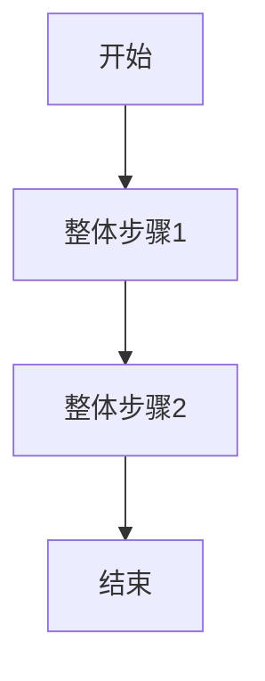
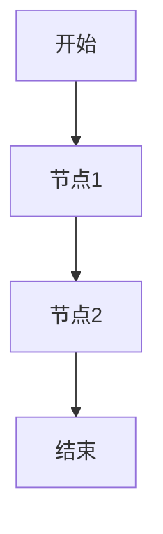

# 需求文档模板（PRD Template）

> 本模板用于规范化产品需求文档结构。从 Wiki 获取的原始文档应按此格式进行转换。

---

# [需求标题]

## 修订记录

| 版本号 | 修订日期 | 修订内容简述 | 修订人 | 审核人 | 状态 |
|--------|----------|--------------|--------|--------|------|
| V1.0 | | 初始版本创建 | | | 草稿 |

---

## 0. 基本信息

| 字段 | 内容 |
|------|------|
| 目标版本 | |
| PO | |
| ARCH | |
| BA | |
| 设计师 | |
| 业务部门 | |
| 关联 DPMP | |

---

## 1. 业务概览

> 本章节只放与需求整体相关的内容，不放某个单独功能点的局部设计。
>
> 存量文档差异化写作规则：如果本需求是基于一份历史 PRD、Wiki 或存量设计文档提出的新变更，不要在新 PRD 中完整复述旧逻辑。旧文档只作为背景、术语、现状和差异判断依据；正文应重点描述本次新增、修改、删除的内容，以及本次变更带来的影响范围、兼容规则和验收标准。

### 1.1 需求背景与业务目标

### 1.2 关联需求

| 关联类型 | ID / 来源 | 标题 | 关联说明 / 用途 | 当前状态 |
|----------|-----------|------|-----------------|----------|
| REQ / EPIC / Story / Wiki / 云文档 / PDF / Word / 历史需求 | | | 背景参考 / 规则依据 / 原型说明 / 历史方案 | 已纳入 / 待补充 |

### 1.3 用户与应用场景

| 角色 | 作业场景 | 核心诉求/痛点 | 频率 |
|------|----------|---------------|------|
| | | | |

### 1.4 术语表

| 术语/实体/视图 | 定义 | 类型（新增/已有） |
|----------------|------|------------------|
| | | |

### 1.5 总体业务流程 / 全局流程图（可选）

> 仅当本需求涉及跨角色、跨系统、跨页面或多状态流转，且图示比文字更清楚时填写。简单增删改、字段调整、文案调整、单按钮交互等场景可以删除本节，直接在功能点中用文字或表格说明。

### 1.6 用户职责和权限

| 角色 | 发起 | 审批 | 查看 | 编辑 | 删除 | 备注 |
|------|------|------|------|------|------|------|
| | | | | | | |

---

## 2. 功能需求

### 2.2 [功能点一标题]

#### 2.2.1 菜单

| 项目 | 内容 |
|------|------|
| 所属系统/端侧 | |
| 菜单路径 | |
| 入口条件 | |
| 权限要求 | |

#### 2.2.2 核心逻辑

**逻辑说明：**

| 维度 | 内容 |
|------|------|
| 关键实体/字段 | |
| 输入 | |
| 处理逻辑 | |
| 输出 | |
| 外部接口/依赖 | |
| 边界/异常 | |

#### 2.2.3 流程

> 按需填写。只有当该功能点存在多步骤流转、审批/工作流、跨页面跳转、状态变化或异常分支时，才需要流程图或节点表。简单 Story 不强制绘制流程图；只要在“核心逻辑”中能说清楚，可以删除本节。

| 节点编号 | 节点名称 | 参与角色 | 触发条件 | 处理逻辑 | 输出结果 |
|----------|----------|----------|----------|----------|----------|
| | | | | | |

#### 2.2.4 交互设计

> 按需填写。只有当用户提供原型/截图，或交互规则无法用文字和表格说清楚时，才插入图片。不要生成 `path/to/mockup.png` 这类占位图片；没有图片时保留交互说明表或删除本节。

| 区域/元素 | 交互说明 | 展示/输入规则 | 异常提示 | 备注 |
|-----------|----------|---------------|----------|------|
| | | | | |

### 2.3 [功能点二标题]

#### 2.3.1 菜单

#### 2.3.2 核心逻辑

#### 2.3.3 流程

#### 2.3.4 交互设计

### 2.4 [功能点三标题]

#### 2.4.1 菜单

#### 2.4.2 核心逻辑

#### 2.4.3 流程

#### 2.4.4 交互设计

### 2.5 [功能点四标题]

#### 2.5.1 菜单

#### 2.5.2 核心逻辑

#### 2.5.3 流程

#### 2.5.4 交互设计

---

## 3. 整体验收用例

| 用例编号 | 验收场景 | 前置条件 | 操作步骤 | 预期结果 | 覆盖范围 |
|----------|----------|----------|----------|----------|----------|
| TC-001 | | | | | |

---

## 4. 非功能需求

### 4.1 兼容性要求

| 类型 | 要求 |
|------|------|
| 浏览器兼容性 | |
| 移动端适配 | |
| 分辨率/终端限制 | |

### 4.2 性能要求

| 指标 | 要求 |
|------|------|
| 响应时延 | |
| 并发处理能力 | |
| 批处理/异步任务要求 | |

### 4.3 埋点要求

| 埋点位置 | 事件名 | 采集字段 | 分析目的 |
|----------|--------|----------|----------|
| | | | |

---

## 附录：Story-Feature-MUC 结构分析

表结构以 `story-feature-muc-rules.md` 的“输出表结构”为准，不在模板中重复定义。
