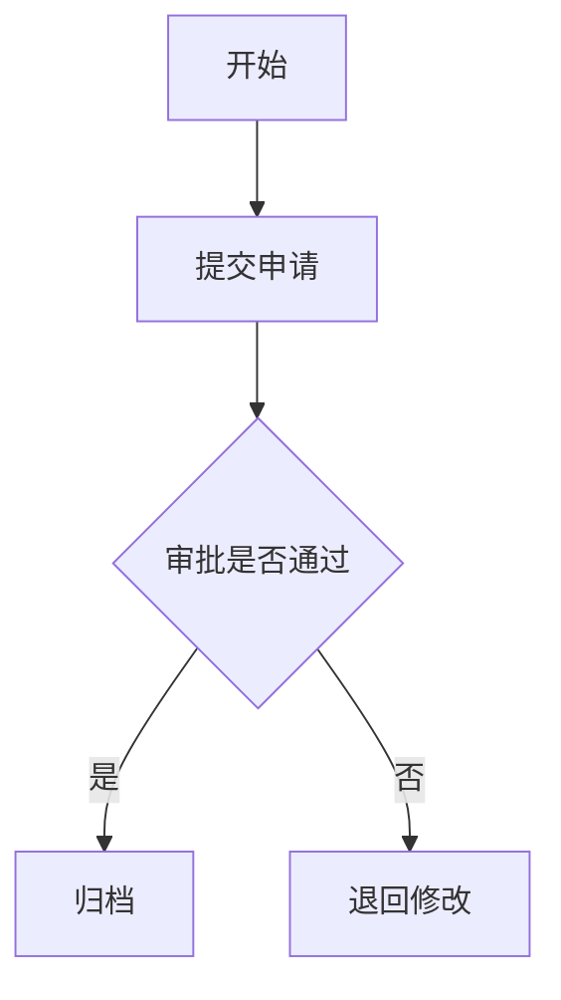

# newdiagram：创建本地 Mermaid 或 drawio 图文件

**触发词：** `newdiagram`、`drawio`、`draw.io`、"流程图"、"画图"、"绘制流程"、"绘制图"

**职责：** 根据自然语言、PRD 片段或本地 Markdown 文档，创建本地图文件。默认输出 `.mmd` Mermaid 文件；用户明确要求 drawio / 可编辑 draw.io / `.drawio` 时，直接生成本地 `.drawio` 文件。

这是一个独立入口：不自动串联 `prd-write`、`prd-convert` 或 `req-review`。

---

## 核心原则

1. 默认输出 `.mmd` Mermaid 文件。
2. 用户明确要求 drawio、可编辑 draw.io、生成 `.drawio` 或 `--format drawio` 时，直接生成本地 `.drawio` 文件。
3. 不要求 Mermaid 直接转换为 drawio；两种格式可以分别从同一份流程理解结果生成。
4. Mermaid 适合直接嵌入 Markdown / PRD；drawio 适合后续可视化编辑。
5. 不得默认跳转到 `app.diagrams.net` 或其他在线编辑网站。
6. 如果后续需要 `.svg` / `.png` 展示图，应从对应源文件导出，快照不是源文件。

---

## 路径规则

REQID 识别规则：只把符合 `^[A-Z]+-\d+$` 的片段识别为 REQID，即大写字母字段 + `-` + 数字，例如 `TAILOR-124`、`REQ-441893759`。小写、缺少连字符或连字符后不是纯数字的片段，不作为 REQID。

有 REQID 时，优先通过 `newreq` 或 `resolve-workspace` 获取需求空间上下文，写入：

```text
newreq/<REQID>/diagrams/[DIAGRAM]<标题>.mmd
newreq/<REQID>/diagrams/[DIAGRAM]<标题>.drawio
newreq/<REQID>/PRODUCT_DESIGN/images/[流程图]<标题>.svg
```

无 REQID 时，不追问，写入当前工作目录：

```text
diagrams/[DIAGRAM]<标题>.mmd
diagrams/[DIAGRAM]<标题>.drawio
images/[流程图]<标题>.svg
```

说明：

- 需求空间下的 `diagrams/` 存放 Mermaid / drawio 源文件，位于 `PRODUCT_DESIGN/` 同级。
- `PRODUCT_DESIGN/images/` 存放 Markdown / PRD 可嵌入展示图。
- 标题不超过 20 个中文字符，去掉路径非法字符。

---

## 创建流程

1. 解析用户输入，识别图类型：流程图、状态流转图、泳道图、系统交互图、页面跳转图或待确认。
2. 提取节点、动作、判断条件、分支、开始和结束。
3. 判断输出格式：默认 `mermaid`；用户明确要求 drawio / `.drawio` / 可编辑 draw.io / `--format drawio` 时使用 `drawio`。
4. 确定输出路径，并创建本地 `diagrams/` 目录。
5. 按目标格式生成本地文件：Mermaid 保存为 `.mmd`，drawio 保存为 `.drawio`。
6. 输出本地文件路径；Mermaid 返回可嵌入 Markdown / PRD 的代码块，drawio 返回可编辑源文件路径。

完成输出示例：

```text
已生成本地 Mermaid 源文件：
diagrams/[DIAGRAM]审批流程.mmd

如需嵌入 PRD，可使用：


如需可编辑 draw.io 图，可继续执行：
/newdiagram --format drawio 员工提交申请，主管审批，通过后归档，驳回则退回修改
```

---

## Mermaid 生成规范

绘制流程图时必须优先生成 Mermaid，除非用户明确要求 drawio XML：

- 默认使用 `flowchart TD`。
- 节点 ID 使用稳定 ASCII 标识，如 `A`, `B`, `C1`，节点文本使用中文业务语义。
- 判断节点使用 `{}`，流程节点使用 `[]`，开始/结束可使用 `([开始])` / `([结束])`。
- 主流程从上到下，成功 / 是 / 通过 分支保持主线向下。
- 否 / 异常 / 失败 分支使用横向分支，并用清晰标签标注。
- 边标签必须使用双引号包裹，尤其是包含括号、斜杠、冒号、空格或中英文混排时。正确示例：`A -->|"验证失败（密码错误）"| B`；不要写成 `A -->|验证失败（密码错误）| B`。
- 回退 / 重试 关系必须单独标注，不要把回退线和主流程语义混在同一条边上。
- Mermaid 文件只保存 Mermaid 源码，不包裹 Markdown 代码围栏。

## drawio 生成规范

用户要求 drawio 时，直接生成本地 `.drawio` 文件。文件内容必须是 drawio 可打开的 XML / mxfile 格式。

- 布局：采用 Top-to-Bottom 布局。主流程（Yes/通过）必须保持在同一垂直中心线上。
- 间距：节点间纵向间距固定为 80px，横向分支间距固定为 150px。
- 节点：所有流程框（矩形）和决策框（菱形）统一宽度为 160px。矩形、开始/结束和过程节点可开启圆角（rounded=1）；菱形节点使用 `shape=rhombus` 时不得使用 `rounded=1`。
- 连线：统一使用直角折线（orthogonal）。“否/异常”分支统一从右侧引出。
- 防重叠：严禁节点坐标重叠。若存在并行分支，需自动增加该层级的整体宽度以避让。

draw.io XML 兼容性约束：

- 不要在 mxCell 之间插入 XML 注释（例如 `<!-- -->`）。draw.io 在线编辑器和部分 VS Code drawio 插件版本可能无法正确解析这类注释。
- 菱形节点必须使用 `shape=rhombus`，不得使用 `rounded=1`。`rhombus` 形状不支持圆角属性，添加后可能导致图文件不可打开或渲染异常。

配色方案：

| 节点类型 | 填充色 | 边框色 |
|----------|--------|--------|
| 开始/结束 | #D5E8D4 | #82B366 |
| 过程节点 | #DAE8FC | #6C8EBF |
| 决策节点 | #FFF2CC | #D6B656 |
| 报错/错误 | #F8CECC | #B85450 |

---

## 导出流程

用户输入 `export <mermaid文件路径|drawio文件路径> [--format svg|png]` 时：

1. 检查源文件是否存在。
2. 默认导出 `svg`。
3. 输出到同级或相邻 `images/` 目录。
4. 返回 Markdown 引用和源文件链接。

```markdown


源文件：[审批流程.mmd](./diagrams/[DIAGRAM]审批流程.mmd)
```

---

## 禁止行为

- 不要把 `app.diagrams.net` 在线页面作为默认绘图入口。
- 不要把 `open_drawio_mermaid` 当作本地 `.drawio` 生成方式。
- 不要只打开网页而不生成本地 `.mmd` 或 `.drawio` 文件。
- 不要在没有本地文件路径的情况下声称已生成图。
- 不要把 `.drawio` 当成 Markdown 可直接预览图片嵌入。
