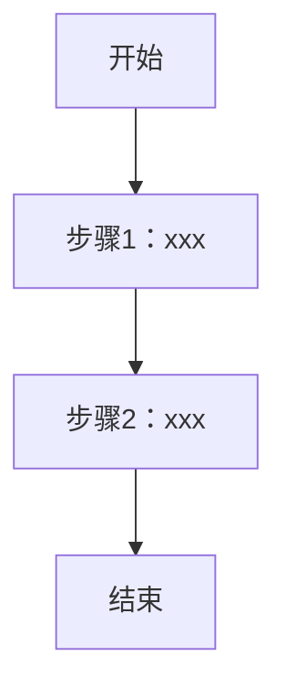
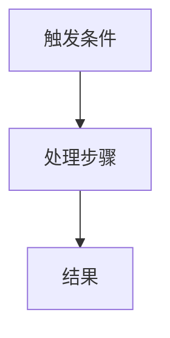

# [需求标题]

## 修订记录

| 版本号 | 修订日期 | 修订内容简述 | 修订人 | 审核人 | 状态 |
|--------|----------|--------------|--------|--------|------|
| V1.0 | YYYY-MM-DD | 初始版本创建 | | | 草稿 |

---

## 1. 文档概述

### 1.1 产品愿景

<!-- 一句话：从 A 到 B，实现 C -->

### 1.2 核心问题

| 痛点 | 现状 | 目标 |
|------|------|------|
| | | |

### 1.3 前序文档依赖

| 文档 | 关联说明 |
|------|----------|
| | |

---

## 2. 基本信息

| 字段 | 内容 |
|------|------|
| 目标版本 | |
| PO | |
| 业务部门 | |

---

## 3. 业务概览

### 3.1 需求背景与业务目标

<!-- 描述为什么要做这个需求，期望达成什么业务目标 -->

### 3.2 用户与应用场景

| 角色 | 应用场景 | 核心痛点 | 频率 |
|------|----------|----------|------|
| | | | |

### 3.3 术语表

| 术语 | 定义 |
|------|------|
| | |

---

## 4. 功能需求

### 4.1 S-01：[Story 标题]

#### 4.1.1 F-01：[需求点标题]

**功能说明：**
<!-- 描述这个功能点做什么 -->

**交互说明：**
<!-- 描述用户如何操作，关键交互步骤 -->

**规则说明：**
<!-- 描述业务规则、数据逻辑、边界条件 -->

#### 验收标准（S-01）

| 编号 | 验收项 | 通过标准 |
|------|--------|----------|
| AC-01 | | |

---

## 5. 交互流程

### 5.1 主流程

### 5.2 异常/分支流程（按需）

---

## 6. MVP 范围定义

| 功能点 | 优先级 | MVP | 二期 |
|--------|--------|-----|------|
| | | | |

### MVP 不包含

-
