# SkillHub 认证方案设计文档（概设）

> 版本：v5.0
> 日期：2026-06-05
> 状态：设计阶段
> 基于：[skillhub-development-design.md](./skillhub-development-design.md) v1.0
> 上一版本(v4.0)修订：简化为直接复用 EIPGW-TOKEN 换票，不再要求短期 JWT

---

## 一、背景与目标

### 1.1 现实约束

SkillHub 自身有独立的认证体系——它**不接受** EIPGW-TOKEN Cookie，只接受自己的 `Authorization: Bearer {skillhub_token}`。

因此需要通过 EIP 网关的身份凭证换取 SkillHub 专用的访问令牌：

```
EIPGW-TOKEN ──→ SkillHub 换票接口 ──→ skillhub_token ──→ SkillHub API
(365d)            一次换票                 正式凭证          所有业务请求
```

### 1.2 已具备的基础设施

| 能力 | 来源 | 状态 |
| --- | --- | --- |
| EIP 网关登录 | `auth/` 模块（fanxuande 分支已合入） | ✅ 已有 |
| EIPGW-TOKEN 获取 | `auth/auth-service.ts:getToken()` | ✅ 已有 |
| Token 加密存储 | `safeStorage` | ✅ 已有 |
| SkillHub 换票接口 | `POST /ai_skillhub_bff/api/v1/auth/token` | 🆕 待对接 |

### 1.3 目标

```
① 复用现有 EIP 登录模块，不改动 auth.json 结构
② 用 EIPGW-TOKEN 调 SkillHub 换票接口换取 skillhub_token
③ safeStorage 加密存储 skillhub_token 到 skillhub-auth.json
④ 所有 SkillHub API 请求自动携带 Authorization: Bearer {skillhub_token}
⑤ skillhub_token 过期时自动用 EIPGW-TOKEN 重新换票
```

### 1.4 v5.0 vs v4.0 核心变化

| 差异点 | v4.0（旧） | v5.0（新） |
|--------|-----------|-----------|
| 换票凭证 | 短期 JWT（4h），需登录模块同步保存 | **EIPGW-TOKEN**（365d），直接复用现有 `getToken()` |
| auth.json 改动 | 需要新增 `encryptedShortToken` 等字段 | **不动**，auth.json 结构不变 |
| 换票端点 | `POST /skillhub/auth` | `POST /ai_skillhub_bff/api/v1/auth/token?clientId=proma` |
| 复杂度 | 短期+长期双 Token 管理 | **单 Token**，一次换票 |

---

## 二、认证流程

### 2.1 总体时序

```mermaid
sequenceDiagram
    participant User as 👤 用户
    participant App as 🖥️ Proma App
    participant EIP as 🛡️ EIP 网关
    participant AuthSvc as 🏢 SkillHub 认证
    participant Hub as 📦 SkillHub

    rect rgb(45, 50, 65)
        Note over User,EIP: 第一步：EIP 登录（已有，不改动）
        User->>App: 输入工号 + 密码
        App->>EIP: POST /gateway/login
        EIP-->>App: EIPGW-TOKEN（365d）
        App->>App: safeStorage → auth.json
    end

    rect rgb(50, 45, 40)
        Note over User,AuthSvc: 第二步：EIPGW-TOKEN 换 SkillHub Token
        User->>App: 打开 SkillHub 面板
        App->>AuthSvc: POST /ai_skillhub_bff/api/v1/auth/token<br/>Cookie: EIPGW-TOKEN={EIPGW-TOKEN}
        AuthSvc-->>App: { accessToken, expiresIn }
        App->>App: safeStorage → skillhub-auth.json
    end

    rect rgb(40, 50, 45)
        Note over User,Hub: 第三步：调用 SkillHub API
        App->>Hub: POST /market/skills<br/>Authorization: Bearer {skillhub_token}
        Hub-->>App: 200
    end

    rect rgb(50, 40, 45)
        Note over User,Hub: 第四步：Token 过期自动换票
        App->>Hub: POST /market/skills
        Hub-->>App: 401
        App->>AuthSvc: POST /auth/token<br/>Cookie: EIPGW-TOKEN={EIPGW-TOKEN}
        AuthSvc-->>App: { accessToken, expiresIn }
        App->>Hub: POST /market/skills（重试）
    end
```



### 2.2 第一步：EIP 登录（已有，不修改）

Proma 已通过 fanxuande 分支合入了完整的 EIP 登录模块：

- 用户在 Proma 中完成 EIP 网关登录
- 获得 EIPGW-TOKEN（Cookie，有效期 365 天）
- `safeStorage` 加密存储到 `~/.proma/auth.json`
- 通过 `auth/auth-service.ts:getToken()` 随时读取

SkillHub 认证模块**不修改** `auth.json` 的结构，只通过 `getToken()` 获取 EIPGW-TOKEN。

### 2.3 第二步：EIPGW-TOKEN 换 SkillHub Token

```
触发时机：用户首次打开 SkillHub 面板时自动执行

POST http://skillhub.uat.saas.htsc/ai_skillhub_bff/api/v1/auth/token?clientId=proma
Headers:
  Cookie: EIPGW-TOKEN={getToken()}

↓

SkillHub 认证服务：
  1. 从 Cookie 中提取 EIPGW-TOKEN
  2. 通过 EIP 网关验证此 Token 的有效性
  3. 解密工号、验证权限
  4. 签发 SkillHub 专用 Token

↓

返回：
{
  "accessToken": "sk-abc123...",
  "expiresIn": 7200       // 2 小时
}

↓

safeStorage.encryptString(accessToken) → base64 → skillhub-auth.json
```

### 2.4 第三步：调用 SkillHub API

所有 SkillHub API 请求通过统一入口 `skillHubFetch()` 自动注入 Bearer Token：

```
Authorization: Bearer {skillhub_token}
```

详细接口设计见 [skillhub-development-design.md](./skillhub-development-design.md)。

### 2.5 第四步：Token 过期自动换票

```
1. SkillHub API 返回 401
2. 重新执行换票：用 getToken() 获取 EIPGW-TOKEN → POST /auth/token
3. 成功 → 更新 skillhub-auth.json → 重试原请求
4. 失败 → 网络不通则提示"SkillHub 不可用"
5. EIPGW-TOKEN 也过期（极少见）→ 提示"请重新登录 EIP 网关"
```

---

## 三、Token 生命周期对比

| 维度 | EIPGW-TOKEN | skillhub_token |
| --- | --- | --- |
| 来源 | EIP 网关登录 | SkillHub 换票接口 |
| 有效期 | **365 天** | 由 SkillHub 服务端决定（预期 2 小时） |
| 存储位置 | `~/.proma/auth.json` | `~/.proma/skillhub-auth.json` |
| 加密方式 | `safeStorage` | `safeStorage` |
| 传递方式 | `Cookie: EIPGW-TOKEN=...` | `Authorization: Bearer ...` |
| 过期后行为 | 重新登录 EIP | 用 EIPGW-TOKEN 重新换票 |

两种 Token 各司其职，互不耦合：

| 请求目标 | Token | Header |
|---------|-------|--------|
| EIP 网关（模型拉取/升级检测） | EIPGW-TOKEN | `Cookie: EIPGW-TOKEN=...` |
| SkillHub API | skillhub_token | `Authorization: Bearer ...` |

---

## 四、数据存储

### 4.1 auth.json（已有，不动）

```
~/.proma/auth.json
{
  "encryptedToken": "<safeStorage base64>",
  "expiresAt": 1748950000000,
  "createdAt": 1717372000000,
  "jobId": "022480",
  "lastLoginAt": 1717372000000
}
```

由 `auth/auth-service.ts` 管理，SkillHub 模块只通过 `getToken()` 读取。

### 4.2 skillhub-auth.json（新增）

```
~/.proma/skillhub-auth.json
{
  "version": 1,
  "accessToken": "<safeStorage base64>",
  "expiresAt": 1717405200000,
  "updatedAt": "2026-06-05T10:00:00Z"
}
```

由 `skillhub-auth-service.ts` 管理。

---

## 五、认证状态机

```
           ┌──────────┐   getToken()=null      ┌──────────────┐
           │not_      │────────────────────────→│              │
     ┌────→│logged_in │                         │ need_eip_    │
     │     └────┬─────┘                         │ login        │
     │          │ EIP 登录（已有）                  └──────┬───────┘
     │          ▼                                         │ 跳转登录页
     │     ┌──────────┐                                   │
     │     │authenti- │   exchangeToken()                  │
     │     │cating    │←──用 EIPGW-TOKEN 换票─────────────┘
     │     └────┬─────┘
     │          │ 换票成功
     │          ▼
     │     ┌──────────┐   skillhub_token 过期   ┌──────────────┐
     │     │connected │───exchangeToken()───────→│ unreachable  │
     └─────│          │                         │（网络不通）    │
           └──────────┘                         └──────────────┘
```

说明：
- `not_logged_in`：`getToken()` 返回 null，EIP 未登录
- `authenticating`：正在调用 `POST /auth/token` 换票
- `connected`：skillhub_token 有效，可正常调用 SkillHub API
- `need_eip_login`：EIP Token 过期（极少见），需重新登录
- `unreachable`：网络不通或 SkillHub 服务不可用

---

## 六、模块划分

### 6.1 涉及文件

| 文件 | 操作 | 说明 |
|------|------|------|
| `auth/auth-service.ts` | **不改动** | 已有 EIP 登录和 `getToken()`，直接复用 |
| `auth/` 目录 | **不改动** | fanxuande 分支已合入 |
| `main/lib/skillhub-auth-service.ts` | 🆕 新增 | 换票 + Token 缓存 + 自动刷新 |
| `main/lib/skillhub-service.ts` | ✏️ 修改 | `fetch()` → `skillHubFetch()` 统一注入 Bearer |
| `main/ipc.ts` | ✏️ 修改 | 注册认证状态查询 Handler |
| `preload/index.ts` | ✏️ 修改 | 暴露认证状态 API |

### 6.2 skillhub-auth-service.ts 职责

- `exchangeToken()`：用 `getToken()` 获取 EIPGW-TOKEN，调 `POST /auth/token` 换取 skillhub_token
- `getValidSkillHubToken()`：获取有效 Token（缓存未过期直接返回，过期自动换票）
- `getSkillHubAuthStatus()`：返回认证状态（用于前端 UI）
- `clearSkillHubAuth()`：清除 skillhub-auth.json

### 6.3 skillhub-service.ts 修改

统一请求入口，自动注入 Bearer Token：

```
所有 SkillHub API 请求 → skillHubFetch() → 注入 Authorization: Bearer
```

---

## 七、前端 UI 状态

| 状态 | 触发条件 | UI 展示 |
| --- | --- | --- |
| `not_logged_in` | `getToken()` 返回 null | 🔒 未登录 · 前往登录 |
| `authenticating` | 正在调 `POST /auth/token` | ⏳ 正在连接 SkillHub... |
| `connected` | skillhub-auth.json 有效 | ✅ 已连接 · Skill 列表可用 |
| `token_expired` | skillhub_token 过期，换票失败 | ⚠️ SkillHub 令牌过期 · 重试 |
| `unreachable` | 网络不通 | ⚠️ SkillHub 不可用 · 重试 |

---

## 八、安全约定

- 所有 Token 加密存储：`safeStorage.encryptString()` → base64
- EIPGW-TOKEN 通过 `Cookie` 传递，仅用于与 EIP 网关 / SkillHub 认证通信
- skillhub_token 通过 `Authorization: Bearer` 头传递，仅用于 SkillHub API
- `safeStorage.isEncryptionAvailable()` 为 false 时降级明文（需记录警告日志）
- Token 不写入日志、不返回给前端（前端只拿状态枚举）

---

## 九、实施步骤

| 步骤 | 文件 | 内容 |
|------|------|------|
| 1 | `main/lib/skillhub-auth-service.ts` | 新增：`exchangeToken()`、`getValidSkillHubToken()`、状态查询 |
| 2 | `main/lib/skillhub-service.ts` | 改造：所有请求走 `skillHubFetch()` 统一注入 Token |
| 3 | `main/ipc.ts` | 注册 `SKILLHUB_AUTH_STATUS` Handler |
| 4 | `preload/index.ts` | 暴露 `getSkillHubAuthStatus()` |
| 5 | 前端 `AuthStatusBar.tsx` | 认证状态栏 UI |

---

## 十、对外约定（SkillHub 后端需提供）

| 端点 | 方法 | 请求 | 响应 |
| --- | --- | --- | --- |
| `/ai_skillhub_bff/api/v1/auth/token?clientId=proma` | POST | `Cookie: EIPGW-TOKEN={...}` | `{ accessToken, expiresIn }` |

> 当前对接环境为 **UAT**：`http://skillhub.uat.saas.htsc`

---

*详细实现见 [skillhub-development-design.md](./skillhub-development-design.md)。本文档为概设，描述认证方案的整体原则和流程。*
