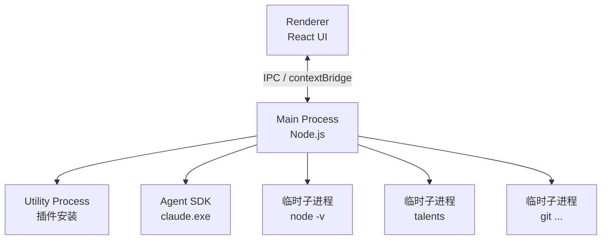

# 进程模型

本文档说明 WorkMate 客户端的进程架构，并以 hi-agent 连接器认证 Token 的流转为具体示例，展示数据如何在各进程间传递。

---

## 进程总览

项目中存在六类进程：



### 主进程 (Main Process)

`src/main/` 目录下的代码，唯一实例。拥有完整 Node.js 权限，负责窗口管理、IPC 处理、文件系统、认证、连接器初始化等所有业务逻辑。用完即走的 `execFile` / `spawn` 调用均由此发起。

### 渲染进程 (Renderer Process)

`src/renderer/` 下的 React UI，每个 `BrowserWindow` 一个实例，沙箱运行。仅通过 preload 暴露的有限 API 与主进程通信。

### Preload 桥接

`src/preload/index.ts`，在渲染进程上下文中通过 `contextBridge` 暴露主进程能力。

### Utility Process

`src/main/plugin-install-worker.ts`，由 Electron `utilityProcess.fork()` 启动的轻量子进程，专门执行插件安装任务，避免阻塞主进程。通过 `parentPort.postMessage` 通信。

### Agent SDK 子进程

Claude Agent SDK 原生 binary（`claude.exe`），每次 Agent 会话创建时启动。`sdkEnv`（含各连接器注入的环境变量）作为 `env` 传入。Agent 在子进程内执行 `talents` 等工具命令时，环境变量逐级继承。

### 临时子进程

`execFile` 发起的各类一次性命令（`node -v`、`npm bin -g`、`talents.cmd workspace --json` 等），拿结果即退出。

---

## 示例：hi-agent 认证 Token 如何贯穿各进程

以最常见的「用户登录 → Agent 会话中使用 talents 命令」链路为例，展示数据在各进程间的实际流转。

### 第 1 步：换票（主进程内）

`skillhub-auth-service.ts` 中的 `exchangeToken()` 用 EIPGW-TOKEN Cookie 向 SkillHub 发 POST 请求，拿到 `accessToken` 后写入 `~/.htskill/auth.json`：

```json
{
  "uat": {
    "accessToken": "eyJhbG...",
    "expiresAt": "2026-06-27T00:00:00.000Z",
    "env": "uat",
    "gatewayBaseUrl": "http://talentshub-uat..."
  }
}
```

`auth.json` 是唯一持久化数据源。此后所有读取方都直接读这个文件，不经过任何中间缓存。

### 第 2 步：注入主进程（主进程内）

`hiagent-auth-service.ts` 的 `getValidUatToken()` 或启动时的 `restoreHiAgentEnv()` 读 `auth.json`，写入主进程全局环境：

```
readUatAuth() → setEnvFromEntry()
  ├─ process.env.HTSKILL_TOKEN = entry.accessToken
  └─ process.env.AGENTOS_ENV = entry.env
```

这一步的值仅主进程自身可见。主进程随后 spawn 的子进程**不会**自动继承 `process.env` 上的这个值——子进程的环境由各自的逻辑显式构造。

### 第 3 步：启动 Agent SDK 子进程（主进程 → 子进程）

用户发起一次对话，`agent-orchestrator.ts` 构建 `sdkEnv`，其中 `collectCliConnectorEnv()` 遍历所有已启用的 CLI 连接器，为 hi-agent 独立读一次 `auth.json`：

```
collectCliConnectorEnv()
  → readUatAuth()                              // 第 2 次读同一个文件
  → resolveCliConnectorEnv(definition, {
        HTSKILL_TOKEN: auth.accessToken         // 传给模板引擎
    })
  → cli.json 的 env 解析:
      "HTSKILL_TOKEN": "{{HTSKILL_TOKEN}}"  →  从 secrets 取值 → 填入真实 Token
      "AGENTOS_ENV": "uat"                  →  非模板 → 字面量永远 "uat"
  → 合并进 sdkEnv
```

最终 `sdkEnv` 作为 `env` 选项传给 `execFile(claude.exe, args, { env: sdkEnv })`。

### 第 4 步：Agent 调用 talents（子进程内）

Agent SDK 子进程收到 prompt 后执行 `talents workspace --json`。因为 `sdkEnv` 已作为子进程环境，`HTSKILL_TOKEN` 和 `AGENTOS_ENV` 被子进程内的 `talents` 命令自然继承。

### 关键观察

1. **同一份文件，两次独立的读**：主进程 `process.env` 注入和子进程 `sdkEnv` 构建各自调用 `readUatAuth()`，互不依赖。Token 刷新后，下次各自重新读文件才会生效。

2. **不存在跨进程的"全局"状态**：`process.env` 只对主进程有效，`sdkEnv` 只在子进程创建时构造一次。没有任何内存级的共享 cache。

3. **`cli.json` env 模板机制**：`resolveCliConnectorEnv()` 仅识别 `{{VARIABLE}}` 格式。非模板值（如 `"uat"`）当字面量直接输出。这意味着 `AGENTOS_ENV` 目前硬编码为 `uat`，无法在运行时切换。

---

## 相关文件

| 文件 | 作用 |
|------|------|
| `src/main/lib/skillhub-auth-service.ts` | SkillHub 换票，写入 auth.json |
| `src/main/lib/hiagent-auth-service.ts` | 读写 auth.json，注入 process.env |
| `src/main/lib/cli-connector-runtime.ts` | 解析 cli.json env 模板，收集连接器环境变量 |
| `src/main/lib/default-connector-initializer.ts` | 连接器初始化流程 |
| `src/main/lib/agent-orchestrator.ts` | Agent 编排，构建 sdkEnv 并启动 SDK 子进程 |
| `src/main/lib/orchestrator/sdk-env.ts` | SDK 环境变量构建 |
| `default-connectors/hi-agent/cli.json` | CLI 连接器定义文件 |
