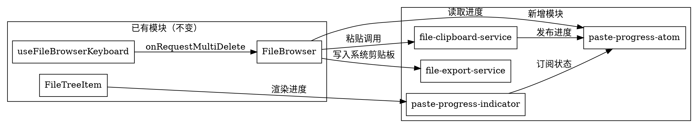

# 工作区文件操作优化方案

## 概述

针对工作区文件浏览器的三个核心问题进行优化：多选操作支持、粘贴异步化与进度反馈、工作区与外部系统的文件交换。

## 背景

当前工作区文件树基于 `FileBrowser` 组件，已在上一次重构中按 SRP 拆分为：

- `FileBrowser.tsx` — 文件树容器（656 行）
- `FileTreeItem.tsx` — 单行文件/文件夹组件（806 行）
- `useFileBrowserKeyboard.ts` — 键盘快捷键 hook
- `file-path-utils.ts` — 路径工具函数
- `file-drag-utils.ts` — 拖拽常量与辅助函数
- `file-clipboard-atoms.ts` — 应用内虚拟剪贴板（Jotai atom）

本次优化在此基础上继续扩展，新增 3 个模块。

---

## 需求

### 问题 1：多选操作支持

**现象：** 键盘快捷键和右键菜单的多选删除、复制、剪切操作有缺失。

**根因分析：**

| 入口 | 当前行为 | 问题 |
|------|----------|------|
| 键盘 Delete | `useFileBrowserKeyboard` 只传第一个选中路径给 `handleRequestDelete` | 确认对话框只显示一个文件名 |
| 粘贴目标计算 | `getPasteTargetDir` 只在单选时用选中路径推导 | 多选时总是落到根目录 |
| 右键删除 | 传 `onDelete(entry)`（单个 entry） | 但 `handleDelete` 遍历 `selectedPaths`，实际执行正确；只是确认对话框信息不准 |

**修复方案：**

1. **Delete 键**：新增 `onRequestMultiDelete` prop 给 `useFileBrowserKeyboard`，直接触发确认对话框（不使用 `handleRequestDelete` 的单文件包装）
2. **粘贴目标**：多选时统一粘贴到根目录（安全默认，因为多选的目标目录语义不明确）
3. **确认对话框**：显示实际将被删除的文件数量 `selectedPaths.size`

### 问题 2：粘贴异步化 + 进度标记

**现象：** 粘贴大文件或多文件时 UI 卡顿阻塞，没有任何进度提示，用户可能重复粘贴。

**方案：**

- 粘贴队列并发执行（最多 5 个并发），fire-and-forget 不阻塞 UI
- 通过 Jotai atom `pasteProgressAtom` 实时发布每个文件的粘贴状态
- `FileTreeItem` 渲染行内进度标记（spinner / 勾 / 叉）
- 全部完成后自动 `loadRoot()` 刷新文件树

**进度状态模型：**

```ts
type PasteStatus = 'pending' | 'done' | 'error'

interface PasteProgressEntry {
  path: string        // 目标文件路径（粘贴后的路径）
  status: PasteStatus
  errorMessage?: string
}
```

**UI 表现：**

- `pending`：行右侧显示小型 spinner + "复制中..."
- `done`：绿色勾，1.5s 后自动消失
- `error`：红色叉 + 错误信息，保持显示直到用户关闭或粘贴队列结束

### 问题 3：粘贴到外部系统

**现象：** 工作区文件无法导出到外部系统文件夹。

**子需求：**

- A. Ctrl+C 同时将路径写入系统剪贴板（CF_HDROP / text/uri-list）
- B. 右键菜单增加"导出到..."→ 系统文件夹选择器 → 复制
- C. 支持从工作区拖出文件到系统资源管理器

**方案：**

- A：`copyOrCutToClipboard` 调用后额外执行 `writePathsToSystemClipboard(selectedPaths)`，通过 IPC 写入系统剪贴板
- B：`FileTreeItem` 右键菜单新增"导出到..."项，调用 `openFolderDialog` → `copyFile` 到系统目录
- C：修改 `handleDragStart` 的 `event.dataTransfer`，增加系统可识别的 MIME 类型；或通过 Electron `webContents.startDrag()` API

**平台适配：**

| 功能 | Windows | macOS |
|------|---------|-------|
| 系统剪贴板 | `clipboard.writeBuffer('CF_HDROP', ...)` | `clipboard.writeBuffer('NSFilenamesPboardType', ...)` |
| 拖出到外部 | `startDrag({ file, icon })` | `startDrag({ file, icon })` |

---

## 架构设计

### 新增模块

```
file-browser/
├── file-clipboard-service.ts      ← NEW: 粘贴队列管理 + 进度追踪
├── file-export-service.ts         ← NEW: 系统剪贴板写入 + 导出到文件夹
├── paste-progress-atom.ts         ← NEW: 粘贴进度 Jotai atom
├── paste-progress-indicator.tsx   ← NEW: 粘贴中标记组件
└── index.ts                       (更新 barrel 导出)
```

### 模块职责边界



### 各模块接口

#### `paste-progress-atom.ts`

```ts
import { atom } from 'jotai'

export type PasteStatus = 'pending' | 'done' | 'error'

export interface PasteProgressEntry {
  targetPath: string
  status: PasteStatus
  errorMessage?: string
}

/** 粘贴进度 Map：key 为目标路径 */
export const pasteProgressAtom = atom<Map<string, PasteProgressEntry>>(new Map())

/** 辅助：添加/更新进度条目 */
export const upsertPasteProgressAtom = atom(
  null,
  (get, set, entry: PasteProgressEntry) => {
    const prev = new Map(get(pasteProgressAtom))
    prev.set(entry.targetPath, entry)
    set(pasteProgressAtom, prev)
  }
)

/** 辅助：批量清除 */
export const clearPasteProgressAtom = atom(
  null,
  (_get, set) => set(pasteProgressAtom, new Map())
)
```

#### `file-clipboard-service.ts`

```ts
/** 并发粘贴队列（最多 5 并发），fire-and-forget */
export async function pastePathsToTarget(
  paths: string[],
  targetDir: string,
  mode: 'copy' | 'cut',
  onProgress: (entry: PasteProgressEntry) => void,
  onComplete: () => void,
): Promise<void>

/** 并发限制 */
const MAX_CONCURRENCY = 5
```

内部实现：
- 用 `Promise.all` + 信号量控制并发
- 每个文件操作完成时调用 `onProgress`
- 全部 settled 后调用 `onComplete`

#### `file-export-service.ts`

```ts
/** 将文件路径写入系统剪贴板（CF_HDROP / NSFilenamesPboardType） */
export async function writePathsToSystemClipboard(paths: string[]): Promise<void>

/** 打开系统文件夹选择器，将文件复制到目标目录 */
export async function exportPathsToFolder(paths: string[]): Promise<void>
```

#### `paste-progress-indicator.tsx`

```tsx
interface PasteProgressIndicatorProps {
  targetPath: string
}

export function PasteProgressIndicator({ targetPath }: PasteProgressIndicatorProps): React.ReactElement | null
```

### 修改的现有模块

#### `FileBrowser.tsx`

差异变更：

1. `handlePaste` 重构为 fire-and-forget，调用 `pastePathsToTarget`
2. `copyOrCutToClipboard` 末尾调用 `writePathsToSystemClipboard`
3. 新增 `handleRequestMultiDelete` 给键盘 hook 使用
4. 粘贴完成回调中自动 `loadRoot()` + 清除进度 atom

```ts
// 修改后的 handlePaste 核心逻辑
const handlePaste = React.useCallback((clipboard: FileClipboard) => {
  const targetDir = getPasteTargetDir()
  if (clipboard.mode === 'cut') {
    // 剪切保持同步（文件系统 move 很快）
    void movePathsToDirectory(clipboard.paths, targetDir).finally(() => setFileClipboard(null))
    return
  }

  // 复制：异步并发
  pastePathsToTarget(
    Array.from(new Set(clipboard.paths)),
    targetDir,
    'copy',
    (entry) => setPasteProgress(entry),     // 进度回调
    () => {
      clearPasteProgress()
      loadRoot()
      onFilesMoved?.()
    },
  )
}, [getPasteTargetDir, loadRoot, onFilesMoved, movePathsToDirectory, setFileClipboard])
```

#### `useFileBrowserKeyboard.ts`

新增 prop `onRequestMultiDelete: () => void`，Delete 键检测到 `selectedPaths.size > 0` 时调用。

#### `FileTreeItem.tsx`

1. 行右侧渲染 `PasteProgressIndicator`
2. 右键菜单新增"导出到..."项（仅选中项含文件时显示，目录行显示）
3. `handleDragStart` 增加系统拖放支持

---

## 错误处理

| 场景 | 处理 |
|------|------|
| 目标文件已存在 | IPC 层自动追加 "(1)" 后缀 |
| 源文件被外部删除 | 跳过该项，进度标记 `error` |
| 权限不足 | `error` 标记 + console.error |
| 跨盘移动 | IPC 层用 copyFile + unlink 降级 |
| 粘贴队列超 256 文件 | 剪贴板路径截断，队列不限 |
| FileBrowser 卸载 | `useEffect` cleanup 清除进度 atom |
| 粘贴过程中切换到其他目录 | 进度仅影响当前 FileBrowser 实例 |

---

## 测试要点

1. 多选 3 个文件 → Delete → 确认对话框显示 "3 个项目"
2. 多选文件+文件夹 → Ctrl+C → 在外部资源管理器 Ctrl+V 成功
3. 粘贴大文件 → 文件树行显示 spinner → 完成后出现文件
4. 粘贴 10 个小文件 → 并发执行（不超过 5 个同时）→ 逐个标记完成
5. 右键"导出到..."→ 选择系统文件夹 → 文件出现在目标文件夹
6. 拖出文件到外部资源管理器 → 文件被复制到目标位置
7. 粘贴过程中关闭工作区 → 进度 atom 正确清理
